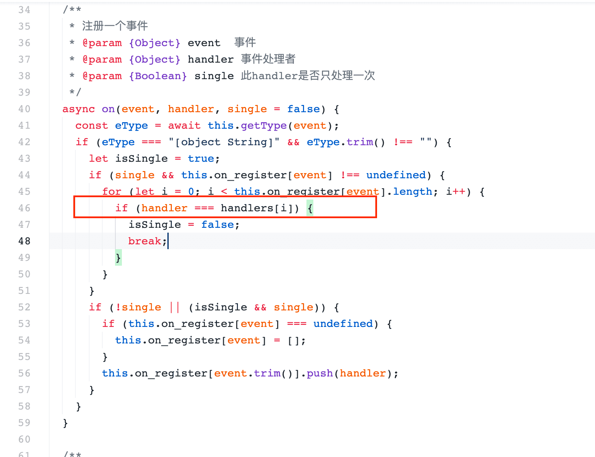

# web.socket - 更新日志

## 1.1.2.0 (2021-08-24)

- 解决 `*` 事件无法监听
- 修正文档

## 1.1.1.0 (2021-07-15)

- 修复严重问题，在源码1.1.0.0中，第46行`handlers`未被定义，在项目中会导致无法预料的严重问题。
  

## 1.1.0.0（2021-04-29）

添加插件示例(npm包混入了demo)

## 1.0.0.3（2020-12-28）
修复自定义事件无法使用问题～

## 1.0.0.2（2020-12-28）
事件名修正 HEARTBARE > HEARTBEAT

## 1.0.0.1（2020-12-28）
封装的开始～～

百度网盘转阿里云盘工具：

https://shenqiduizhang.lanzoui.com/i778Oqtii9a

motrix.下载器：https://motrix.app/

直链解析网址：https://baidu.kinh.cc/

白嫖百度网盘七天会员软件：

https://shenqiduizhang.lanzoui.com/iLMSoqbpj1c

请复制到浏览器打开下载

KinhDown：

https://kinhdown.kinh.cc/

支持平台：windows

原创不易，如果每天的分享对你有用，请点下文末guang告支持下小编！